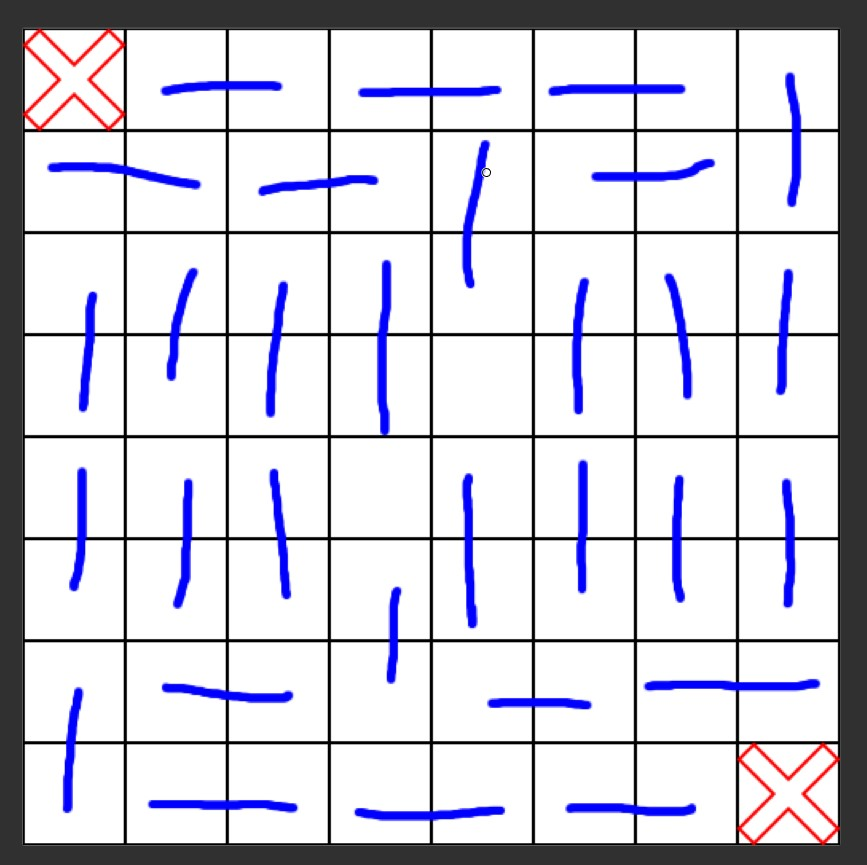

## Question
There is an 8x8 chessboard in which two diagonally opposite corners have
been cut off. You are given 31, and a single domino can cover exactly two 
squares. Can you use the 31 dominos to cover the entire board? Prove your 
answer (by providing an example showing why it's impossible).

## Process
My initial thought was to check if there was actually enough space.
8 x 8 board minus 2 squares leaves 62 spaces on the board to cover, and there
are enough dominos to cover 62 spaces.

I decided to look at patterns I created in paint.net

I found that no matter where you place your domino, you are always creating an 
odd row or column. This means that you are constantly creating a space with an
odd amount of space.

## Answer
No, you cannot completely fill this chessboard. This is because there are are
rows/columns with an odd amount. When you try to fill in these odd spaces, you
create new odd spaces. You can never completely eliminate these odd spaces.
